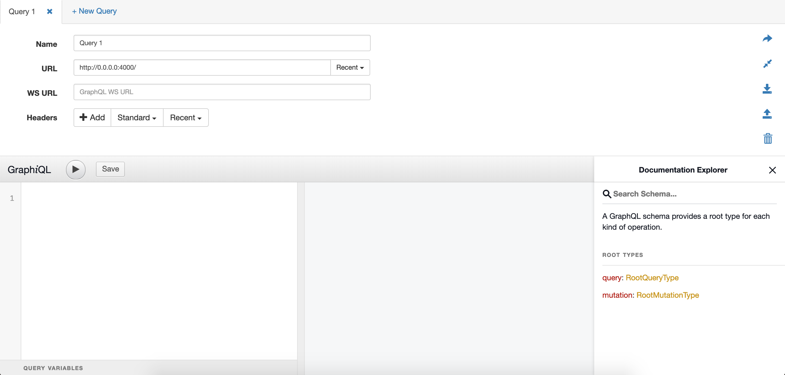
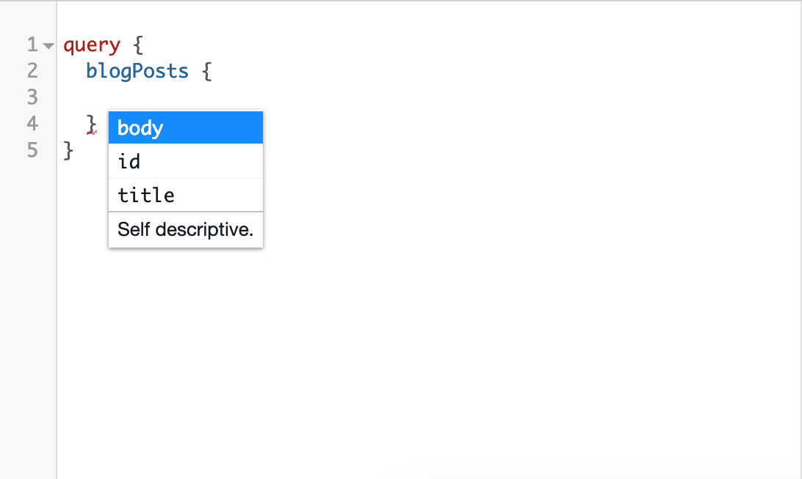
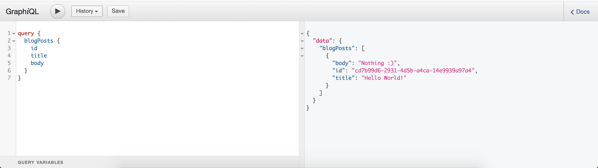
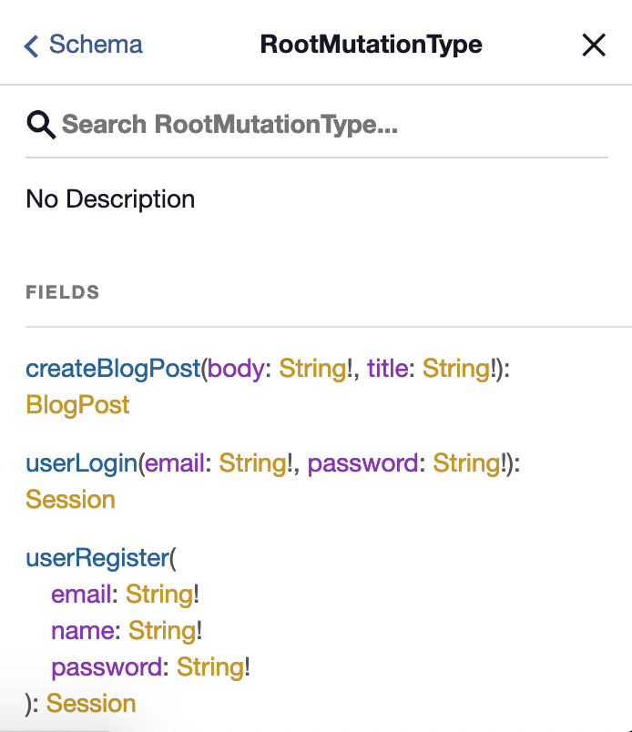
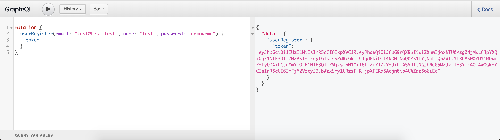
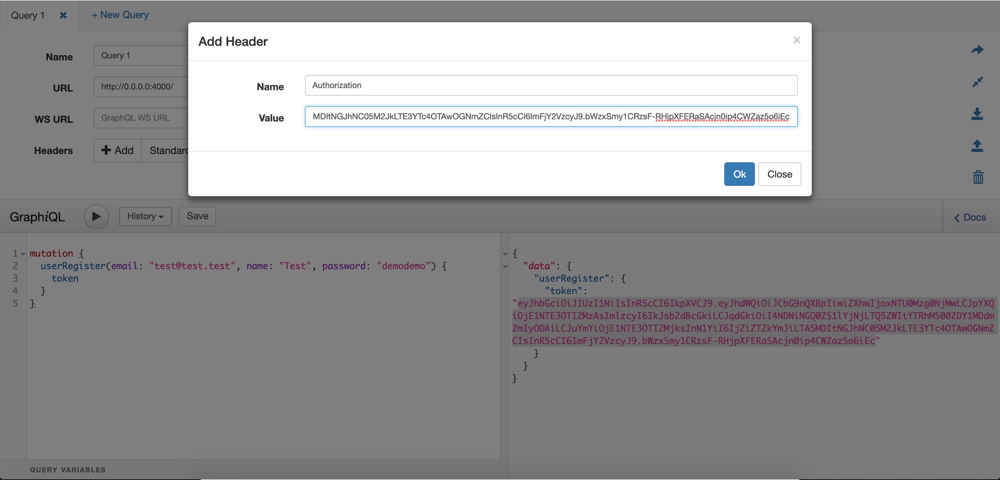
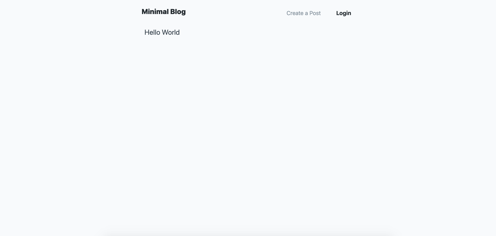
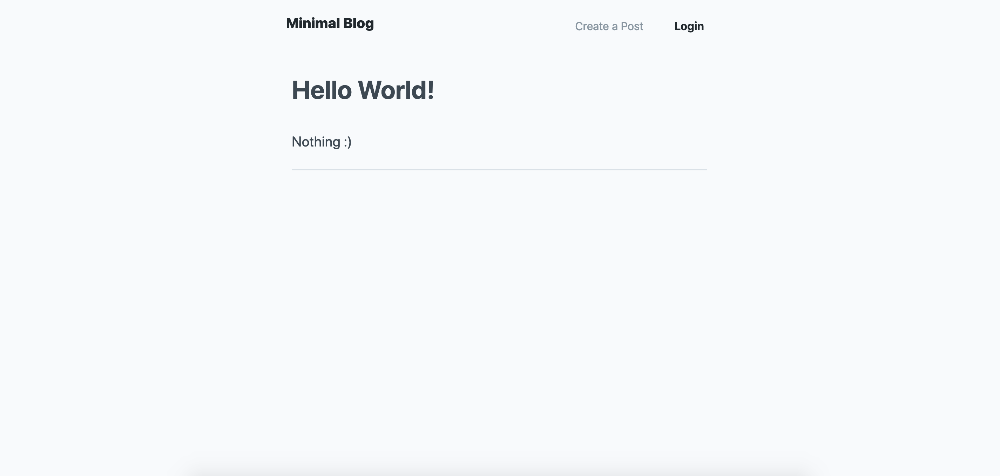

# Create an app with Elixir, ReasonML and GraphQL

In this article, we're going to build a blog with Elixir, GraphQL and ReasonML. And to make it a bit more interesting, we're going to add the authentication and permissions layers. I didn't want to split the article in parts, so it is going to be a pretty long one, but I'll try to make it concise I promise!

Here's what we will do:

- [Create an app with Elixir, ReasonML and GraphQL](#create-an-app-with-elixir-reasonml-and-graphql)
  - [GraphQL API in Elixir](#graphql-api-in-elixir)
    - [Getting started](#getting-started)
    - [Create data models](#create-data-models)
    - [Reference author in posts](#reference-author-in-posts)
    - [Add Absinthe](#add-absinthe)
    - [Authentication](#authentication)
    - [List the blog posts](#list-the-blog-posts)
    - [CRUD API for Blog Posts](#crud-api-for-blog-posts)
    - [Login and Register](#login-and-register)
    - [Testing with GraphiQL](#testing-with-graphiql)
  - [SPA with ReasonML](#spa-with-reasonml)
    - [Getting started](#getting-started-1)
    - [Pages and routing](#pages-and-routing)
    - [Configure GraphQL](#configure-graphql)
    - [List the blog posts](#list-the-blog-posts-1)
    - [Authentication](#authentication-1)
    - [Create a blog post](#create-a-blog-post)
  - [Going Further](#going-further)

## GraphQL API in Elixir

### Getting started

I'll assume that you have Elixir and Phoenix installed, if not, you can follow the instructions to install Elixir [here](https://elixir-lang.org/install.html), and install the latest Phoenix version with:

```bash
mix archive.install hex phx_new 1.4.1
```

First, let's create our project:

```bash
mkdir blog && cd blog
mix phx.new api --no-html --no-webpack --binary-id --app blog_api
```

The `--no-html` indicates that we don't want to generate the HTML views: we will just serve our ReasonML app for the frontend. I like to use UUIDs for the database primary keys, so we need to use the `--binary-id` option as well.

Make sure the project has been generated correctly by running Phoenix server:

```bash
cd blog/
mix deps.get
mix ecto.create
mix ecto.migrate
mix phx.server
```

If you connect to the API with your web browser ([http://0.0.0.0:4000/](http://0.0.0.0:4000/)), you should see a `no route found for GET /` error. That's fine, we'll configure the routes in the next session.

### Create data models

To create a blog app, our API will need to support users and blog posts. We will take care of the GraphQL definitions later, for now, let's create the data models and some functions to create, read, update and delete our ressources.

In Phoenix, the business logic is separated from the web logic. This is why you have two directories in the `lib/` directory:

- `lib/blog_api` will contain our data models and business logic.
- `lib/blog_api_web` will contain our API definition and web server configuration.

In the `blog_api` directory, is is recommended to separate your files into contexts. In our case, we will have two contexts:

- `accounts` that will handle the users, permissions, authentication, etc.
- `blog` where we will put our blog posts models

So let's create our contexts with two data models: `users` and `posts`. Phoenix has a generator to create new data models, here is how to generate ours:

```bash
mix phx.gen.json Accounts User users name:string email:string
mix phx.gen.json Blog Post posts body:text title:string
mix ecto.migrate
```

Phoenix generated a few things for you:

- Migration files that you can run with `mix ecto migrate`. They are in `priv/repo/migrations/`.
- Data model files. They are in `lib/blog_api/blog/post.ex` and `lib/blog_api/accounts/users.ex` respectively.
- Context files that offer a unified API for the whole context. They are in  `lib/blog_api/blog.ex` and `lib/blog_api/accounts.ex` respectively.
- Controllers that offer a CRUD API for our new resources. They are in `lib/blog_api_web/controllers/`.
- Views. They are in `lib/blog_api_web/views`.
- Unit tests for your new context API. They are in `tests/blog_api/accounts/accounts_test.ex` and `tests/blog_api/blog/blog_test.ex` respectively. There is also test for our controllers.

This is really exhaustive! Actually, so exhaustive that there is a few things that we won't need. Because we are building a GraphQL API, we do not use the views are the controllers. The later will be replaced by something called a "resolvers" later on. We can go ahead and delete them:

```bash
rm -rf lib/blog_api_web/controllers/
rm -rf lib/blog_api_web/views/
rm -rf test/blog_api_web/controllers/
rm -rf test/blog_api_web/views/
```

Alright, let's try and run our free unit tests!

```bash
mix test
................

Finished in 0.2 seconds
16 tests, 0 failures

Randomized with seed 537767
```

Great, we can create and index blog posts and users! Something is missing though: we need to reference the author of the blog post. Let's do it now.

### Reference author in posts

Here, we want to add a `belong_to` association from our post table to our user table. When we want to change the definition of our table, we need to operate at two levels: the migrations and the data models.

In the `create_post` migration, simply add a line:

```elixir
add(:author_id, references(:users, on_delete: :delete_all, type: :uuid))
```

This will add a new field that references a user. We also configure `ON DELETE CASCADE` to delete the blog posts when we delete the users.

Note that here we are modifying an existing migration. Of course, if the application was already deployed in production, we would create a new one to update the table instead.

To reset our database, we can use the mix alias `ecto.reset`:

```bash
# For dev
mix ecto.reset
# For test
MIX_ENV=test mix ecto.reset
```

Our table now has a new field for the author, let's update our data model accordingly. In `lib/blog_api/blog/post.ex`, update the `schema` macro:

```elixir
schema "posts" do
  field(:body, :string)
  field(:title, :string)
  belongs_to(:author, BlogApi.Accounts.User)
  timestamps()
end
```

Ecto, the query builder we are using, uses the notion of changeset to update the database. Among other things, the changeset will validate that our update is valid according to our business logic. We added a new reference to the table user, so let's update our changeset to validate that the user indeed exists (this is done at the database level also, but it's always better to catch the errors with the changesets):

```elixir
def changeset(post, attrs) do
  post
  |> cast(attrs, [:body, :title, :owner_id])
  |> validate_required([:body, :title, :owner_id])
  |> assoc_constraint(:owner)
end
```

That's it, now our post reference a user, and we are validating that the user exists when we are updating the table. Let's run our unit tests to make sure everything is working:

```bash
** (MatchError) no match of right hand side value: {:error, #Ecto.Changeset<action: :insert, changes: %{body: "some body", title: "some title"}, errors: [author_id: {"can't be blank", [validation: :required]}], data: #BlogApi.Blog.Post<>, valid?: false>}
```

Ugh, everything is broken 😞

The error is given by the changeset, it says: `author_id: "can't be blank"`. That's because we didn't provide an author when we created our blog posts in our unit tests. We need to change the `post_fixture` function to look like this:

```elixir
def post_fixture(attrs \\ %{}) do
  {:ok, author} = BlogApi.Accounts.create_user(%{name: "Test User", email: "test@test.test"})

  {:ok, post} =
    attrs
    |> Enum.into(Map.put(@valid_attrs, :author_id, author.id))
    |> Blog.create_post()

  post
end
```

And our `create_post/1` test to look like this:

```elixir
test "create_post/1 with valid data creates a post" do
  {:ok, author} = BlogApi.Accounts.create_user(%{name: "Test User", email: "test@test.test"})
  assert {:ok, %Post{} = post} = Blog.create_post(Map.put(@valid_attrs, :author_id, author.id))
  assert post.body == "some body"
  assert post.title == "some title"
end
```

Run the unit tests again, and… it passes 💪

### Add Absinthe

To use GraphQL with Elixir, we will be using a (very awesome) library called Absinthe. Mix, Elixir's dependency manager (among other things), does not have a command to add a new dependency, so we need to add it manually in our `mix.exs`. In this file, you will find a function definition `defp deps do`. Simply add these lines inside the definion:

```elixir
{:absinthe, "~> 1.4.0"},
{:absinthe_ecto, "~> 0.1.3"},
{:absinthe_plug, "~> 1.4.2"},
```

And run `mix deps.get`.

Now that we have Absinthe, we can configure our application's router to serve it. In `lib/blog_api_web/router.ex`, replace the current content with the following:

```elixir
defmodule BlogApiWeb.Router do
  use BlogApiWeb, :router

  forward("/api", Absinthe.Plug, schema: BlogApiWeb.Schema, json_codec: Jason)
  forward("/", Absinthe.Plug.GraphiQL, schema: BlogApiWeb.Schema, json_codec: Jason)
end
```

This will serve your API when you query the `/api` endpoint, and it will serve GraphiQL when you query the root endpoint `/`. If you don't know what is GraphiQL yet, don't worry, we will be using it and you will understand what it does very quickly. For now, you can see it as an IDE for you GraphQL API.

The last thing that we need to do is to provide a schema definition for our API. We'll add the endpoints (or nodes in GraphQL jargon) in the next session, but we still need to define our root query node and root mutation node. We can put our schema definition in `lib/blog_api_web/schema.ex`:

```elixir
defmodule BlogApiWeb.Schema do
  use Absinthe.Schema

  query do
  end

  mutation do
  end
end
```

That's it, we are ready to define our API! The query nodes will be defined in query, and the mutations in mutation.

### Authentication

Our GraphQL API is ready to be developped, but let's do one last thing before we start implementing our nodes.

As you can see in the router, Absinthe handles the queries. It will parse the them, read the the schema we defined and pass the correct parameter to the correct resolver. Alongside the parameter, it will also pass some information that might be useful for us, those information are grouped in a context. To implement our API, we will need an information that is not in the context by default: the current user. So we need to tell Absinthe to add this information in all the context it passes to our resolvers.

Doing this is pretty straightforward, first we create a module in our accounts context that will authenticate a user, in `lib/blog_api/accounts/user_auth.ex`:

```elixir
defmodule BlogApi.Accounts.UserAuth do
  alias BlogApi.Accounts.User

  @doc """
  Return the user if the authentication parameters are valid (the password matches).
  If the parameters are invalid, return an error.
  """
  @spec authenticate(%{login: String.t(), password: String.t()}) ::
          {:ok, User} | {:error, String.t()}
  def authenticate(params) do
    user = BlogApi.Repo.get_by(User, login: params.login)

    case check_password(user, params.password) do
      true -> {:ok, user}
      _ -> {:error, "Incorrect login credentials"}
    end
  end

  def hash_password(password), do: Comeonin.Bcrypt.hashpwsalt(password)

  @spec check_password(User, String.t()) :: boolean
  defp check_password(user, password) do
    case user do
      nil -> false
      _ -> Comeonin.Bcrypt.checkpw(password, user.password_hash)
    end
  end
end
```

We also need to change our user models to store a password. In the `create_users` migration:

```elixir
add(:password_hash, :string)
```

In our `user.ex` model schema:

```elixir
field(:password_hash, :string)
field(:password, :string, virtual: true)
```

Finally, replace the changeset by the following two changesets:

```elixir
@required_fields ~w(email name)a

@doc false
def registration_changeset(user, attrs) do
  user
  |> cast(attrs, @required_fields ++ [:password])
  |> validate_required(@required_fields ++ [:password])
  |> unique_constraint(:email)
  |> validate_length(:password, min: 6)
  |> put_pass_hash()
end

@doc false
def update_changeset(user, attrs) do
  user
  |> cast(attrs, @required_fields ++ [:password])
  |> validate_required(@required_fields)
  |> unique_constraint(:email)
  |> validate_length(:password, min: 6)
  |> put_pass_hash()
end

defp put_pass_hash(changeset) do
  case changeset do
    %Ecto.Changeset{valid?: true, changes: %{password: pass}} ->
      put_change(changeset, :password_hash, BlogApi.Accounts.UserAuth.hash_password(pass))

    _ ->
      changeset
  end
end
```

Now we need to update our accounts context API (`lib/blog_api/accounts.ex`):

```elixir
def create_user(attrs \\ %{}) do
  %User{}
  |> User.registration_changeset(attrs)
  |> Repo.insert()
end

...

def update_user(%User{} = user, attrs) do
  user
  |> User.update_changeset(attrs)
  |> Repo.update()
end
```

And add a password to the attributes map when we create a user in our unit tests:

```elixir
defmodule BlogApi.AccountsTest do
  ...
  @valid_attrs %{email: "some email", name: "some name", password: "password"}
  ...
end
```

```elixir
defmodule BlogApi.BlogTest do
  ...
  {:ok, author} = BlogApi.Accounts.create_user(%{name: "Test User", email: "test@test.test", , password: "password"})
  ...
end
```

At this point, if you run the unit tests, you should have a missing dependency error. If you noticed, we are using two functions to hash and check the password in our auth module: `Comeonin.Bcrypt.hashpwsalt` and `Comeonin.Bcrypt.checkpw`. They come from the Bcrypt encryption library, so we need to add Bcrypt as a dependency in our `mix.exs`:

```elixir
{:comeonin, "~> 4.0"},
{:bcrypt_elixir, "~> 1.0"}
```

Don't forget to run `mix deps.get` after you change the dependencies.

You will also have an error because we are comparing the created user with the queried one. The former contains a password, and the later does not. To fix this, you can replace fixture of the unit test by:

```elixir
def user_fixture(attrs \\ %{}) do
  {:ok, user} =
    attrs
    |> Enum.into(@valid_attrs)
    |> Accounts.create_user()
  Map.put(user, :password, nil)
end
```

Ok, so now we have a password for our users, we want to pass the current user to our GraphQL context. To get the current user, we will use `JWT`. We will need to get the token from the users queries and get the user corresponding to the token. There is a nice Elixir library that does just that: Guardian.

Using Guardian is really simple. First we create a Plug in `lib/blog_api_web/plugs/graphql_context.ex`:

```elixir
defmodule BlogApiWeb.Plugs.GraphQLContext do
  @behaviour Plug

  @type t :: %{context: map()}

  alias BlogApi.Accounts.User

  def init(opts), do: opts

  def call(conn, _) do
    case Guardian.Plug.current_resource(conn) do
      nil ->
        conn

      user = %User{} ->
        Absinthe.Plug.put_options(
          conn,
          context: %{current_user: user, conn: conn}
        )
    end
  end
end
```

This defines a behaviour for Plug. To learn more about behaviours, you can refer to the [documentation](https://elixir-lang.org/getting-started/typespecs-and-behaviours.html). The logic here is pretty simple: we ask Guardian to get the resource associated to the current connection, if Guardian returned a user, we put it in the Absinthe context, if it returned null, we just forward the connection. Now, Guardian is really nice, but not magical: we still need to tell it how to fetch the ressource from a connection. To do this, we create a few configuration files:

- In `lib/blog_api_web/auth/guardian_serializer.ex`:

  ```elixir
  defmodule BlogApiWeb.Auth.GuardianSerializer do
    use Guardian, otp_app: :blog_api
  
    alias BlogApi.{Repo, Accounts.User}
  
    def subject_for_token(user = %User{}, _claims), do: {:ok, to_string(user.id)}
    def subject_for_token(_, _), do: {:error, "Unknown resource type"}
  
    def resource_from_claims(%{"sub" => user_id}), do: {:ok, Repo.get(User, user_id)}
    def resource_from_claims(_claims), do: {:error, "Unknown resource type"}
  end
  ```

- In `lib/blog_api_web/auth/bearer_auth_pipeline.ex`:

  ```elixir
  defmodule BlogApiWeb.Auth.BearerAuthPipeline do
    use Guardian.Plug.Pipeline,
      otp_app: :blog_api,
      module: BlogApiWeb.Auth.GuardianSerializer,
      error_handler: BlogApiWeb.Auth.ErrorHandler
  
    plug(Guardian.Plug.VerifyHeader, realm: "Bearer")
    plug(Guardian.Plug.LoadResource, allow_blank: true)
  end
  ```

- In `config/config.exs`:

  ```elixir
  # Configures Guardian
  config :blog_api, BlogApiWeb.Auth.GuardianSerializer,
    issuer: "BlogApi",
    secret_key: "MDLMflIpKod5YCnkdiY7C4E3ki2rgcAAMwfBl0+vyC5uqJNgoibfQmAh7J3uZWVK",
    # optional
    allowed_algos: ["HS256"],
    ttl: {30, :days},
    allowed_drift: 2000,
    verify_issuer: true
  ```

- Finally, you can add the dependency in the `mix.exs`: `{:guardian, "~> 1.0"},` and run `mix deps.get`.

Ouf! That's all we need for Guardian, now we can finally use the `GraphQLContext` pipeline we defined in our router:

```elixir
pipeline :api do
  plug(BlogApiWeb.Auth.BearerAuthPipeline)
  plug(BlogApiWeb.Plugs.GraphQLContext)
end

scope "/api" do
  pipe_through([:api])
  forward("/", Absinthe.Plug, schema: BlogApiWeb.Schema, json_codec: Jason)
end

forward("/", Absinthe.Plug.GraphiQL, schema: BlogApiWeb.Schema, json_codec: Jason)
```

That's it, we now have access to a `current_user` field in the Absinthe context in our resolvers. That's was a bit long, but now the fun can begin, in the next section, we are going to implement our API nodes!

### List the blog posts

It's finally time to implement our API, and because we are well-intentioned developers, we will start with the unit tests 😇

Create a file in `test/blog_api_web/schemas/blog_schema_test.exs`:

```elixir
defmodule BlogApisWeb.Schemas.BlogSchemaTest do
  use BlogApiWeb.ConnCase, async: true

  @query """
  query {
    blogPosts {
      id
      title
    }
  }
  """
  test "viewer can list all the posts" do
    {:ok, author} =
      BlogApi.Accounts.create_user(%{
        name: "Test User",
        email: "test@test.test",
        password: "password"
      })

    {:ok, blog_post} =
      BlogApi.Blog.create_post(%{title: "Hello World!", body: "Nothing :)", author_id: author.id})

    response = post(build_conn(), "/api", %{query: @query})
    assert json_response(response, 200)["errors"] == nil

    assert json_response(response, 200)["data"]["blogPosts"] == [
             %{
               "id" => blog_post.id,
               "title" => blog_post.title
             }
           ]
  end
end
```

The GraphQL query we are testing is:

```graphql
query {
  blogPosts {
    id
    title
  }
}
```

We are creating a blog post with the title "Hello World", so this query is supposed to return something list this:

```json
{
  "data": {
    "blogPosts": [
      {
        "id": "3b76b494-50c6-44d5-981c-eea51d433938",
        "title": "Hello World!"
      }
    ]
  }
}
```

If you run the unit tests now, you will have an error `Cannot query field "blogPosts" on type "RootQueryType"` . Of course, we need to add a definition for this node. Let's go back to our `schema.ex` file and add this in our `query` macro:

```elixir
field :blog_posts, non_null(list_of(non_null(:blog_post))) do
  resolve(fn _args, _info ->
    {:ok, BlogApi.Repo.all(BlogApi.Blog.Post)}
  end)
end
```

This defines a new node `blogPosts`, that return a `[BlogPost!]!`, that is a non-null list of non-null blog posts.

To resolve the blog posts, we use our `BlogApi.Repo`, it's the module that we will use for **EVERY** queries that we make. If you want more information about this repo thing, here is a [very interesting talk](https://www.youtube.com/watch?v=YQxopjai0CU&t=325s) about it.

Now, our resolver is returning a list of `blog_post`, but we didn't tell Absinthe what is a `blog_post`. At the beginning of our `schema.ex`, add this definition:

```elixir
object :blog_post do
  field(:id, non_null(:id))
  field(:title, non_null(:string))
  field(:body, non_null(:string))
end
```

That's it, we defined our GraphQL types with the `object macro`, we created a new node with the `field` macro, and we defined a new resolver with the `resolve` macro. Run the tests again, and… Success 🎉!

We now have a fully functionnal GraphQL API, and we implemented a node that returns all the blog posts. In the next section, we'll continue to define nodes to our API in order to have a full CRUD API for our blog posts.

### CRUD API for Blog Posts

This is pretty repetitive at this point, for each node, we create a unit test, we add a node definition, and eventually, we define the return type. I'll accelerate the pace and simply provide the code for each new node, but I will try to add comments where things could be confusing.

**Query a blog post by ID**

Our unit test:

```elixir
@query """
query($id: ID!) {
  blogPost(id: $id) {
    title
  }
}
"""
test "viewer can query a blog post by ID" do
  {:ok, blog_post} = BlogApi.Blog.create_post(%{title: "Hello World!", body: "Nothing :)"})
  # Note how we pass the ID as a variable to the query.
  response = post(build_conn(), "/api", %{query: @query, variables: %{"id" => blog_post.id}})
  assert json_response(response, 200)["errors"] == nil
  assert json_response(response, 200)["data"]["blogPost"] == %{
           "title" => blog_post.title
         }
end
```

And our node definition:

```elixir
field :blog_post, :blog_post do
  # The arg macro allows us to define arguments to our queries.
  # The map of arguments is passed to the resolve function.
  @desc "The primary ID of the blog post to fetch."
  arg(:id, non_null(:id))
  # When we write %{id: id}, we are pattern matching the arguments and put the value of
  # id in id.
  resolve(fn %{id: id}, _info ->
    {:ok, BlogApi.Repo.get(BlogApi.Blog.Post, id)}
  end)
end
```

**Create a new blog post**

Our unit test:

```elixir
@query """
mutation($title: String!, $body: String!) {
  createBlogPost(title: $title, body: $body) {
    title
    body
  }
}
"""
test "viewer can create a blog post" do
  {:ok, author} =
    BlogApi.Accounts.create_user(%{
      name: "Test User",
      email: "test@test.test",
      password: "password"
    })

  {:ok, jwt, _full_claims} = BlogApiWeb.Auth.GuardianSerializer.encode_and_sign(author)

  conn = build_conn() |> Plug.Conn.put_req_header("authorization", "Bearer #{jwt}")

  response =
    post(conn, "/api", %{
      query: @query,
      variables: %{"title" => "Hello World!", "body" => "Nothing :)"}
    })

  assert json_response(response, 200)["errors"] == nil

  assert json_response(response, 200)["data"]["createBlogPost"] == %{
            "title" => "Hello World!",
            "body" => "Nothing :)"
          }
end
```

And our node definition:

```elixir
field :create_blog_post, type: :blog_post do
  arg(:title, non_null(:string))
  arg(:body, non_null(:string))

  resolve(fn
    %{title: title, body: body},
    %{context: %{current_user: _user = %BlogApi.Accounts.User{id: user_id}}} ->
      BlogApi.Blog.create_post(%{title: title, body: body, author_id: user_id})

    _args, _info ->
      {:error, "You need to authentify to create a blog post"}
  end)
end
```

Note that the node definition must be put in the `mutation`, not `query`. Also, you can see that we need to add a HTTP header to our request in our unit test. If you remove this line:

```elixir
conn = build_conn() |> Plug.Conn.put_req_header("authorization", "Bearer #{jwt}")
```

By:

```elixir
conn = build_conn()
```

The unit test will fail with the following error:

```text
You need to authentify to create a blog post
```

### Login and Register

The login and register nodes are fairly easy at this point as we already configured everything we needed to handle the authentication. All we need to do is to add a `session` type that will be returned to the user if the authentication is successful:

```elixir
object :user do
  field(:name, non_null(:string))
  field(:email, non_null(:string))
  field(:blog_posts, non_null(list_of(non_null(:blog_post))))
end

object :session do
  field(:token, non_null(:string))
  field(:user, non_null(:user))
end
```

And we can create two mutations to handle login and register:

```elixir
field :user_login, type: :session do
  arg(:email, non_null(:string))
  arg(:password, non_null(:string))

  resolve(fn args, _info ->
    with {:ok, user} <- BlogApi.Accounts.UserAuth.authenticate(args),
          {:ok, jwt, _full_claims} <- BlogApiWeb.Auth.GuardianSerializer.encode_and_sign(user) do
      {:ok, %{token: jwt, user: user}}
    end
  end)
end

field :user_register, type: :session do
  arg(:email, non_null(:string))
  arg(:name, non_null(:string))
  arg(:password, non_null(:string))

  resolve(fn args, _info ->
    with {:ok, _} <- BlogApi.Accounts.create_user(args),
          {:ok, user} <- BlogApi.Accounts.UserAuth.authenticate(args),
          {:ok, jwt, _full_claims} <- BlogApiWeb.Auth.GuardianSerializer.encode_and_sign(user) do
      {:ok, %{token: jwt, user: user}}
    end
  end)
end
```

### Testing with GraphiQL

I mentionned it when we were configuring the router, Absinthe comes with a tool called GraphiQL. We can use it to play with our GraphQL API. If you go on [http://0.0.0.0:4000/](http://0.0.0.0:4000/) you should see this:



Start typing a query, you should see that the tool offers syntax completion and syntax highlighting:



When you execute your query (with Shift+Enter), the result appears on the right panel:



You can also explore the documentation of your API by click on `Docs`:



One last thing, you can set HTTP headers. First, get a new token by registering a new user:



Then copy the token and click Headers -> Standard -> OAuth 2 Bearer Token. Paste the token after "Bearer":



Once you've added the `Authorization` header, you will be able to create blog posts with GraphiQL!

## SPA with ReasonML

### Getting started

Next, let's generate our web interface. ReasonML (or Bucklescript for this matter) has project generator built in. Here is how to use it:

```bash
yarn global install bs-platform
bsb -init my-react-app -theme react
```

Unfortunately, the generated project is missing a few things such as the HMR configuration for Webpack, or a proper directory structure. I've created my own boilerplate and we are going to use it in this article:

```bash
# In our blog/ directory, alongside the api code
git clone git@github.com:tmattio/reason-react-boilerplate.git web/
cd web/
rm -rf .git
find . -type f -print0 | xargs -0 gsed -i 's/reason-react-boilerplate/blog-reason-ui/g'
```

Let's check that everything is up and running:

```bash
yarn install
yarn start
# In another tab
yarn webpack
```

Note here that we need to run processed for the UI. `yarn start` will start Bucklescript and will compile the ReasonML files when they change. `yarn webpack` will spawn a Webpack server to serve our application.

You should be able to open [http://0.0.0.0:3000/](http://0.0.0.0:3000/) and see a nice "Hello World!" message.

### Pages and routing

To start, we are going to create our pages, and configure the routing to navigate. We are going to implement the following pages

- Home page that will display the latest posts
- A Create Post page to create new blog posts
- An Edit Post page to update existing blog posts
- A Login page to authenticate

Let's create a module `Router.re` that will hold this logic:

```ocaml
type route =
  | Home
  | Login
  | CreatePost
  | NotFound;

let mapUrlToRoute = (url: ReasonReact.Router.url) =>
  switch (url.path) {
  | [""]
  | [] => Home
  | ["login"] => Login
  | ["new-post"] => CreatePost
  | _ => NotFound
  };

let mapRouteToUrlPath = (route: route): list(string) =>
  switch (route) {
  | Home => [""]
  | Login => ["login"]
  | CreatePost => ["new-post"]
  | NotFound => ["404"]
  };

let joinUrlPath = (path: list(string)): string =>
  List.fold_left((acc, el) => acc ++ "/" ++ el, "", path);

let routeTo = (route: route, event) =>
  if (!ReactEvent.Mouse.defaultPrevented(event)) {
    ReactEvent.Mouse.preventDefault(event);
    let href = mapRouteToUrlPath(route) |> joinUrlPath;
    ReasonReact.Router.push(href);
  };

let redirect = (route: route) => {
  let href = mapRouteToUrlPath(route) |> joinUrlPath;
  ReasonReact.Router.push(href);
};

```

Simple enough! We define a `route` type with all the possible route of our application, and we create functions to go from our type to a URL, and from a URL to our type.

Now, the top-level logic of our SPA app is really simple: we take the current URL, try to map it to a `route`, and map the `route` to the correct component. Let's do this in the `App.re`:

```ocaml
open Router;

type state = route;

type action =
  | ChangeRoute(route);

let reducer = (action, _state) =>
  switch (action) {
  | ChangeRoute(route) => ReasonReact.Update(route)
  };

let component = ReasonReact.reducerComponent(__MODULE__);

let make = _children => {
  ...component,
  reducer,
  initialState: () =>
    mapUrlToRoute(ReasonReact.Router.dangerouslyGetInitialUrl()),
  didMount: self => {
    let watcherID =
      ReasonReact.Router.watchUrl(url =>
        self.send(ChangeRoute(url |> mapUrlToRoute))
      );
    self.onUnmount(() => ReasonReact.Router.unwatchUrl(watcherID));
  },
  render: self => {
    switch (self.state) {
    | Home => <Layout> <Home /> </Layout>
    | CreatePost => <Layout> <CreatePost /> </Layout>
    | Login => <Layout> <Login /> </Layout>
    | _ => <Layout> <NotFound /> </Layout>
    };
  },
};
```

With the current code, the compiler will complain because it does not find all those modules. So be it, let's create them.

First, the pages. We will initialize them with a simple "Hello World" message. Create the modules `pages/CreatePost.re`, `pages/Home.re`, `pages/Login.re` and `pages/NotFound.re`, and put the following code inside each modules:

```ocaml
let component = ReasonReact.statelessComponent(__MODULE__);

let make = _children => {
  ...component,
  render: _self => <div> {"Hello World" |> ReasonReact.string} </div>,
};
```

Except for `EditPost`, that takes a `postId` parameter, the code will look like this:

```ocaml
let component = ReasonReact.statelessComponent(__MODULE__);

let make = (~postId: string, _children) => {
  ...component,
  render: _self => <div> {"Hello World" |> ReasonReact.string} </div>,
};
```

Second, we need to create this `Layout` module.

`Layout.re` has a simple job: remove he boilerplate code from our components. This includes styling, the navbar, etc. For the styling, we will be using TailwindCSS. It's a great functionnal CSS library. CSS is not the purpose of the of this article, so I won't explain the library, but I highly recommend that you read about it [here](https://tailwindcss.com/docs/what-is-tailwind/). The only thing we will need is to add a link to their CDN in our `public/index.html`:

```html
<link href="https://cdn.jsdelivr.net/npm/tailwindcss/dist/tailwind.min.css" rel="stylesheet">
```

Then, we can use it to style our `Layout.re`:

```ocaml
let component = ReasonReact.statelessComponent(__MODULE__);

let make = children => {
  ...component,
  render: _self =>
    <div
      className="bg-grey-lightest font-sans leading-normal tracking-normal min-h-screen">
      <nav id="header" className="fixed w-full z-10 pin-t">
        <div
          className="max-w-md mx-auto flex flex-wrap items-center justify-between mt-0 py-3">
          <div className="pl-4">
            <a
              className="text-black text-base no-underline hover:no-underline font-extrabold text-xl"
              href="#" onClick={Router.routeTo(Home)}>
              {ReasonReact.string("Minimal Blog")}
            </a>
          </div>
          <div
            className="flex-grow flex items-center w-auto block mt-2 mt-0 bg-grey-lightest bg-transparent z-20"
            id="nav-content">
            <ul className="list-reset flex justify-end flex-1 items-center">
              <li className="mr-3">
                <a
                  className="inline-block text-grey-dark no-underline hover:text-black hover:text-underline py-2 px-4"
                  href="#">
                  {ReasonReact.string("Create a Post")}
                </a>
              </li>
              <li className="mr-3">
                <a
                  className="inline-block py-2 px-4 text-black font-bold no-underline"
                  href="#">
                  {ReasonReact.string("Login")}
                </a>
              </li>
            </ul>
          </div>
        </div>
      </nav>
      <div className="container w-full max-w-md mx-auto pt-20">
        <div
          className="w-full px-4 px-6 text-xl text-grey-darkest leading-normal">
          ...children
        </div>
      </div>
    </div>,
};
```

Again, you might be very confused about all those classes, but explaining what they do is not the purpose of this article, just see this component as a wrapper that provides style to our app.

Once you've created the pages and the layout, the app should compile and you should see something like this:



We can continue to the next session!

*PS. A small note on this section: you would usually implement the pages one by one, but this was too much overhead for this article. However, you should see the pattern for adding a page: Add an entry in `route` in the `Router.re` module and change the mapping functions accordingly; Create your page module in `pages`; Change the `App.re` module to map the new `route` type to your new page module.*

### Configure GraphQL

The great thing about doing GraphQL with staticly typed languages is that the compiler can assist you to verify that your code is complient with the GraphQL API. GraphQL servers provide an introspection endpoint that will return you GraphQL schema. This schema can then be parsed to generate code in your frontend language. This is not very useful in Javascript, but having all these types generated for you when you're using a typed language is a real blessing: forgot a required parameter? The compiler will tell you; misspelled a word? The compiler will tell you. Doing this is a common practice with typed language. In Elm for example, you have `[elm-graphql](https://github.com/dillonkearns/elm-graphql)`. In ReasonML, we have `[reason-apollo](https://github.com/apollographql/reason-apollo)`.

To use `reason-apollo`, we need to do a few things:

- Install `reason-apollo`

  ```bash
  yarn add reason-apollo
  yarn add --dev graphql_ppx
  ```

- Add `reason-apollo` to your `bs-dependencies` and `graphql_ppx/ppx` to your `ppx_flags`

  ```json
  "bs-dependencies": [
    "reason-react",
    "reason-apollo"
  ],
  "ppx-flags": [
      "graphql_ppx/ppx"
  ]
  ```

- Generate a `graphql_schema.json` which will be used to safely type your GraphQL queries/mutations

  ```bash
  yarn send-introspection-query http://0.0.0.0:4000/api
  ```

- Create an Apollo Client module `Client.re`

  ```ocaml
  let inMemoryCache = ApolloInMemoryCache.createInMemoryCache();
  
  let httpLink =
    ApolloLinks.createHttpLink(~uri="http://0.0.0.0:4000/api", ());
  
  let instance =
    ReasonApollo.createApolloClient(~link=httpLink, ~cache=inMemoryCache, ());
  ```

- Wrap our application with `ApolloProvider` in `Index.re`

  ```ocaml
  ReactDOMRe.renderToElementWithId(
    <ReasonApollo.Provider client=Client.instance>
      <App />
    </ReasonApollo.Provider>,
    "root",
  );
  ```

That's it, your application is configured and we can start writing our queries!

Don't forget to update your schema (i.e. the `yarn send-introspection-query` command) whenever you change your GraphQL API. You will also need to clear the cache with:

```
yarn clean
rm -rf .graphql_ppx_cache/
```

### List the blog posts

We will list the blog posts of our app in the home page (so we will work in the `pages/Home.re` module).

`reason-apollo` uses a very nice library called `graphql_ppx`. A PPX is OCaml's way to do meta-programming, that is, to extend the language syntax. `graphql_ppx` is a PPX that adds the support for… GraphQL syntax! That's right, you can write GraphQL queries  directly in OCaml (or in our case ReasonML) and it will be translated to native code!

Let's do it. In our `Home.re` module, add the following lines:

```ocaml
module GetBlogPosts = [%graphql
  {|
  query {
    blogPosts {
      id
      title
    }
  }
  |}
];

module GetBlogPostsQuery = ReasonApollo.CreateQuery(GetBlogPosts);
```

At this point, when your code compiles, your queries are verified to comply with the GraphQL schema we fetched from our server. Try it, add a field name for example, the compiles will let you know that something's wrong:

```bash
  5 ┆     id
  6 ┆     title
  7 ┆     name
  8 ┆   }
  9 ┆ }

  Unknown field on type BlogPost
```

Awesome right?

Now that our query is ready, let's use it to display the blog posts. Replace the make function by the following:

```ocaml
let viewBlogPost = blogPost => {
  <div>
    <h1
      className="font-sans break-normal text-black pt-6 pb-2 text-3xl md:text-4xl">
      {ReasonReact.string(blogPost.title)}
    </h1>
    <p className="py-6">
      {String.sub(blogPost.body, 0, 50) ++ "..." |> ReasonReact.string}
    </p>
  </div>;
};

let component = ReasonReact.statelessComponent(__MODULE__);

let make = _children => {
  ...component,
  render: _ => {
    <GetBlogPostsQuery>
      ...{({result}) =>
        switch (result) {
        | Loading => <div> {ReasonReact.string("Loading")} </div>
        | Error(error) => <div> {ReasonReact.string(error##message)} </div>
        | Data(response) =>
          <div>
            {Array.map(viewBlogPost, response##blogPosts) |> ReasonReact.array}
          </div>
        }
      }
    </GetBlogPostsQuery>;
  },
};
```

You will notice that the result of the GraphQL query is a union type. It is either `Loading`, `Error`, or `Data`. And **EVERY** results from a GraphQL query will have either of these types. This will force us to handle all the cases for each query, otherwise, well the code will simply not compile.

The code compile, but when we check the browser, the following error occurs:

```
Access to fetch at 'http://localhost:4000/api' from origin 'http://0.0.0.0:3000' has been blocked by CORS policy: Response to preflight request doesn't pass access control check: No 'Access-Control-Allow-Origin' header is present on the requested resource. If an opaque response serves your needs, set the request's mode to 'no-cors' to fetch the resource with CORS disabled.
```

By default, Phoenix does not handle cross-origin requests, so we have to configure it.

Add `cors_plug` dependency in your `mix.exs`:

```elixir
{:cors_plug, "~> 1.5"},
```

And add a plug in your pipeline in `router.ex`:

```elixir
pipeline :api do
  plug(CORSPlug)
  plug(BlogApiWeb.Auth.BearerAuthPipeline)
  plug(BlogApiWeb.Plugs.GraphQLContext)
end
```

With this, Phoenix should accept cross-origin requests, and if we refresh our page, we should see our blog posts!



### Authentication

???

### Create a blog post

???

## Going Further

Our app works, but it's extremely simplistic, a real app would definitely have more features. Here is a list of improvements that you could explore.

**User Profile**

We should be able to click on a username to view the user's profile. For this, we need to add a new node to our API (e.g. `user` that will provide the informations that we need in the user's profile).

In addition, GraphQL APIs often provide a `viewer` node that returns the information of the currently authenticated user. Hint: the resolver of the `viewer` node is really simple because we already have the current user in the GraphQL context!

**Comments**

How about being able to comment a blog post? This is an interesting improvements because it impacts every layers of the app: you need to add a migration, table, data model, context API calls, GraphQL nodes and resolvers, and add the queries in the UI.

**Updating and Deleting resources**

Right now, we cannot delete/update the blog posts, or the users. We could provide mutations to do this.